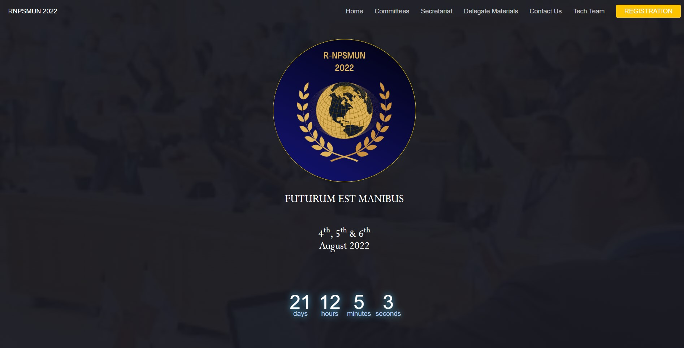

 

  
  <h3 align="center">RNPSMUN 2023</h3>
  

    The official RNPSMUN 2023 website
     
    <a href="https://github.com/rnpsmun2022/rnpsmun2022.github.io"><strong>Explore the docs »</strong></a>
     
     
    <a href="https://rnpsmun2022.github.io/">Visit Website</a>
  

  
Table of Contents

  <ol>
    <li>
      <a href="#about-the-project">About The Project</a>
      <ul>
        <li><a href="#built-with">Built With</a></li>
      </ul>
    </li>
    <li><a href="#usage">Usage</a></li>
    <li><a href="#contact">Contact Us</a></li>
    <li><a href="#acknowledgments">The Tech Team</a></li>
  </ol>

## About The Project

This is the official website of the RNPSMUN2023 Event organsized by NPS RNR, scheduled to be held on the 26th, 27th and 28th of June 2023.

(<a href="#top">back to top</a>)

### Built With

HTML Javascript CSS SCSS

(<a href="#top">back to top</a>)

## Usage

Just go to the website <a href="https://github.com/rnpsmun2022/rnpsmun2022.github.io"><strong>here</strong></a>!

(<a href="#top">back to top</a>)

## Contact Us

You can get in touch with us using rnpsmun2023@gmail.com

(<a href="#top">back to top</a>)

<!-- ACKNOWLEDGMENTS -->
## The Tech Team
Parth K Dubal 
Yash Anand
 

(<a href="#top">back to top</a>)

